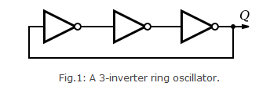
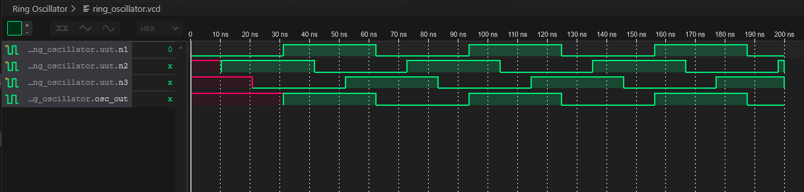

# Ring Oscillator in Verilog

## Overview
This repository contains the Verilog code for a three NOT gate ring oscillator with a parameterized delay. It includes both the module and the testbench to simulate the ring oscillator.

## Ring Oscillators

### Advantages
- **Simplicity**: The design is straightforward and easy to implement, making it ideal for educational purposes and simple applications.
- **Small Footprint**: Requires very few components, taking up minimal space on an integrated circuit.
- **Speed**: High oscillation frequency is possible, depending on the number of stages and the propagation delay of each inverter.
- **Ease of Integration**: Easily integrated into digital circuits for on-chip clock generation and other timing applications.

### Disadvantages
- **Temperature Sensitivity**: The oscillation frequency can be affected by changes in temperature, which may not be suitable for applications requiring high stability.
- **Power Consumption**: Continuous oscillation can lead to higher power consumption, a concern for power-sensitive applications.
- **Process Variability**: Manufacturing process variations can cause inconsistencies in the propagation delay, affecting the oscillation frequency.
- **Limited Frequency Range**: The frequency is determined by the number of stages and the propagation delay, limiting its range and making it less flexible than other types of oscillators.

## About the simulation
### Verilog Module for Three NOT Gate Ring Oscillator with Parameterized Delay
The Verilog code provided defines a three NOT gate ring oscillator with a parameterized delay. This allows for easy modification of the gate delay to suit different requirements.

Key Features:

Parameterized Delay: The DELAY parameter allows the user to specify the propagation delay of the NOT gates when instantiating the module.
Always Blocks: The always blocks represent the NOT gates with a delay specified by the #DELAY syntax, ensuring the correct timing for the oscillation.
Output Assignment: The output of the ring oscillator is assigned to n1, the output of the last NOT gate in the loop.

### Testbench for Ring Oscillator
The testbench module (tb_ring_oscillator) is designed to simulate the ring oscillator and generate a VCD (Value Change Dump) file for waveform analysis.

Key Features:

Instantiation: The ring oscillator module is instantiated with a specified delay of 10ns.
Monitoring: The $monitor system task is used to print the value of osc_out and the current simulation time to the console.
VCD File Generation: The $dumpfile and $dumpvars system tasks create a VCD file named "ring_oscillator.vcd", which records all changes in the testbench for waveform viewing.
Simulation Control: The simulation runs for 200ns and then stops, providing a sufficient duration to observe the oscillation behavior.
The provided code demonstrates a basic yet effective way to implement and test a ring oscillator in Verilog, highlighting the ease of use and simplicity of such oscillators in digital circuit design.

### Simulation results

